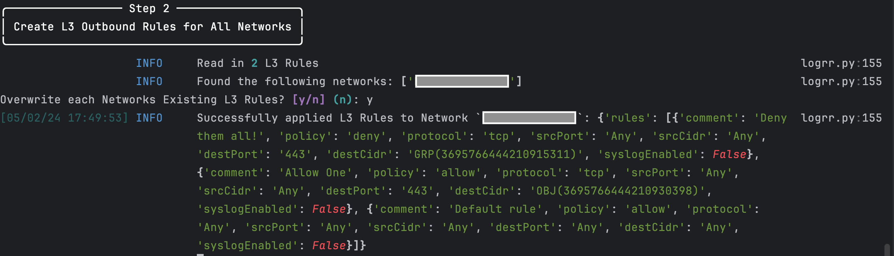
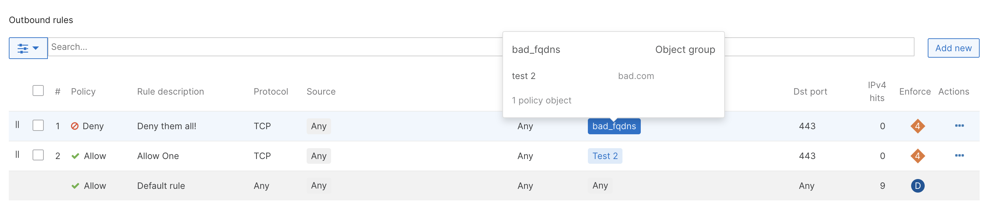

# Meraki Bulk Policy Object, Groups, and L3 Rule Creation

This script creates Meraki Policy Objects, Groups, and/or L3 Outbound Rules in bulk based on CSV files. The script can apply L3 Rules to 1 or more networks.

L3 Rules can either overwrite existing rules or merge with existing rules (duplicate rules ignored) in a network. Rules are created top down, with the order in the CSV file retained.

## Contacts
* Trevor Maco

## Solution Components
* Meraki

## Prerequisites
#### Meraki API Keys
In order to use the Meraki API, you need to enable the API for your organization first. After enabling API access, you can generate an API key. Follow these instructions to enable API access and generate an API key:
1. Login to the Meraki dashboard
2. In the left-hand menu, navigate to `Organization > Settings > Dashboard API access`
3. Click on `Enable access to the Cisco Meraki Dashboard API`
4. Go to `My Profile > API access`
5. Under API access, click on `Generate API key`
6. Save the API key in a safe place. The API key will only be shown once for security purposes, so it is very important to take note of the key then. In case you lose the key, then you have to revoke the key and a generate a new key. Moreover, there is a limit of only two API keys per profile.

> For more information on how to generate an API key, please click [here](https://developer.cisco.com/meraki/api-v1/#!authorization/authorization). 

> Note: You can add your account as Full Organization Admin to your organizations by following the instructions [here](https://documentation.meraki.com/General_Administration/Managing_Dashboard_Access/Managing_Dashboard_Administrators_and_Permissions).

## CSV Files
2 CSV Files are required: `policy_objects.csv` and `l3_outbound_rules.csv` (included in `src`).

If only using one of the CSV files, remove all values from the ignored CSV file. **DO NOT** delete either file.

`Policy Objects CSV File`:
Create Policy Objects and Policy Objects Groups. CSV Column Headers (without "_" prefix) come from the Meraki [API Call](https://developer.cisco.com/meraki/api-v1/create-organization-policy-object/). The column header names must match the API field names exactly and follow the rules specified in the documentation (they are passed as is into the API).

To create Policy Object Groups, specify the name of a group in the "_group_name" field. If the group exists, the object will be added to the group, otherwise a new group will be created.

**Note**: The included example file shows FQDN Objects.

`L3 Outbound Rules CSV File`:
Create L3 Outbound Rules. CSV Column Headers come from the Meraki [API Call](https://developer.cisco.com/meraki/api-v1/update-network-appliance-firewall-l-3-firewall-rules/). The column header names must match the API field names exactly and follow the rules specified in the documentation (they are passed as is into the API).

To use a Policy Object or Policy Object group in a rule, specify the name of the Object or Group in the srcCidr or destCidr fields. It's assumed the objects exist (or were created via the first CSV)!

**Note**: The included example file creates 2 rules, one with a Policy Object and one with a Policy Object Group in the destination field.

## Installation/Configuration
1. Clone this repository with `git clone [repository name]`. To find the repository name, click the green `Code` button above the repository files. Then, the dropdown menu will show the https domain name. Click the copy button to the right of the domain name to get the value to replace [repository name] placeholder.
2. Rename the `.env_sample` file to `.env`. Rename `settings_example.py` to `settings.py` (in `src/config` directory).
3. Add `Meraki API key` and `Org ID` (found at the bottom of a Meraki Org Webpage) to `.env`
```dotenv
MERAKI_API_KEY="API key goes here"
ORG_ID="Org ID goes here"
```
4. (Optional) Specify 1 or more network names in `settings.py` (`src/config`). If network names provided, the script only considers those networks. Leave blank to consider all networks.
```python
# Optional List of Network Names
NETWORK_NAMES = ["network a", "network b", "network c"]
```
**Note**: It's **HIGHLY** recommended to test with a subset of networks first.

5. Set up a Python virtual environment. Make sure Python 3 is installed in your environment, and if not, you may download Python [here](https://www.python.org/downloads/). Once Python 3 is installed in your environment, you can activate the virtual environment with the instructions found [here](https://docs.python.org/3/tutorial/venv.html).
6. Install the requirements with `pip3 install -r requirements.txt`

## Usage

To run the program, use the command:
```
$ python3 main.py
```

The script will create the Policy Objects and Policy Object Groups first. The result of each operation is displayed to the console:


Once Objects are created, the script prompts asking to overwrite existing L3 rules in each network. The script then creates new L3 Rules from the CSV and either merges or overwrites L3 Outbound rules in each considered network.

**WARNING**: `Overwrite` will delete all existing L3 Rules in each considered network. Select with caution.





**Note**: Logs from each run can be found in the `logs` folder

### LICENSE

Provided under Cisco Sample Code License, for details see [LICENSE](LICENSE.md)

### CODE_OF_CONDUCT

Our code of conduct is available [here](CODE_OF_CONDUCT.md)

### CONTRIBUTING

See our contributing guidelines [here](CONTRIBUTING.md)

#### DISCLAIMER:
<b>Please note:</b> This script is meant for demo purposes only. All tools/ scripts in this repo are released for use "AS IS" without any warranties of any kind, including, but not limited to their installation, use, or performance. Any use of these scripts and tools is at your own risk. There is no guarantee that they have been through thorough testing in a comparable environment and we are not responsible for any damage or data loss incurred with their use.
You are responsible for reviewing and testing any scripts you run thoroughly before use in any non-testing environment.